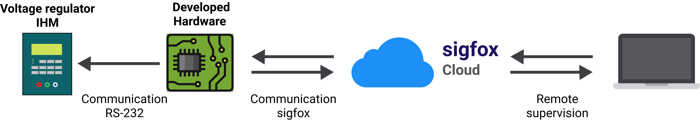

# Remote supervision of high voltage regulator
> 
> :bulb: *The idea of this repository is not to be a complete guide for performing automation and supervision of voltage regulators.*
>  

 

Communication with Toshiba TBR800 control [^1]

## General objective :zap:
In this repository there is the part of the development of a system, to perform the monitoring and change of operational parameters remotely in high voltage regulators.

The system reads data from voltage regulators, through serial communication with the TB-R800 Control, and makes the data available via LPWA network (Sigfox network [^2]).

To change parameters, communication between the client and the regulator is carried out via the GSM network :satellite::iphone:.

### Leitura de dados
The reading and writing of data on the TB-R800 control is performed by an Atmega328p microcontroller through RS-232 communication.

 
 

 
 

> 
> :warning:  <b> Warning </b>
> 
> This is a small part of an P&D project. The information contained here should not be construed as a complete guide. For more information, contact us by email :love_letter:.
>  

 

[^1]:Developed by the authors. 
[^2]:[Sigfox](https://www.sigfox.com/)